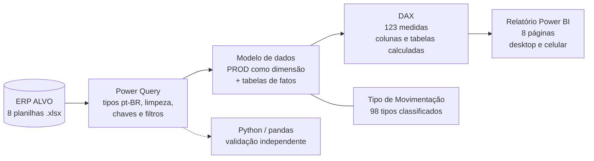

<p align="center">
  
</p>

<h1 align="center">LOGTECH · Gestão de Estoques da CPTM com Business Intelligence</h1>

<p align="center">
  <b>Controle, análise e acompanhamento da evolução e do giro de estoque de materiais na CPTM</b><br/>
  Aprendizagem por Projeto Integrador (API) · Fatec São José dos Campos · Logística · 2026
</p>

<p align="center">
  
  
  
  
  
</p>

---

Olá, somos a equipe **LOGTECH**! Neste projeto desenvolvemos uma solução de Business Intelligence para apoiar a gestão de estoques da **Companhia Paulista de Trens Metropolitanos (CPTM)**, transformando os dados brutos do ERP ALVO em indicadores logísticos confiáveis para a tomada de decisão.

## Índice

- [Sobre a LOGTECH](#sobre-a-logtech)
- [O projeto](#o-projeto)
- [O painel](#o-painel)
- [Indicadores e regras de cálculo](#indicadores-e-regras-de-cálculo)
- [Arquitetura da solução](#arquitetura-da-solução)
- [Estrutura do repositório](#estrutura-do-repositório)
- [Como executar](#como-executar)
- [Validação dos resultados](#validação-dos-resultados)
- [Principais resultados](#principais-resultados)
- [Backlog do produto](#backlog-do-produto)
- [Sprints](#sprints)
- [Tecnologias](#tecnologias)
- [Equipe](#equipe)
- [MKT](#mkt)

## Sobre a LOGTECH

> *Always doing the best!* (Sempre fazendo o melhor!)

Somos uma empresa especializada em soluções logísticas, tecnológicas e ambientais, cujo objetivo é compreender as necessidades dos clientes para melhor atendê-las.

- **Missão:** ser referência em soluções logísticas e tecnológicas, simplificando o transporte e o armazenamento de cargas, com sustentabilidade, otimização de custos e máxima rentabilidade.
- **Valores:** honestidade, transparência, simplicidade, relacionamento próximo com clientes internos e externos e apoio a projetos socioambientais.

### Aprendizagem por Projeto Integrador (API)

O API conecta teoria e prática: os alunos trabalham em equipe em um problema real, aplicando conceitos de diferentes disciplinas do curso e desenvolvendo colaboração, autonomia, proatividade e foco em resultados, com apoio da metodologia ágil **SCRUM**.

## O projeto

**Cliente:** CPTM – Companhia Paulista de Trens Metropolitanos
**Contato do cliente:** Leandro Capergiani Moreira
**Professores:** Newton Yamada (M2) e Marcus Nascimento (P2)

### Desafio

A CPTM disponibilizou um grande conjunto de dados brutos do ERP ALVO (cadastro de materiais, posições de estoque, planejamento de compras, previsão de consumo e cerca de **188 mil movimentações** de 2021 a 2026). O desafio é tratar, organizar e analisar esses dados para responder à principal decisão do cliente:

> **Quando e quanto repor cada material**, garantindo a disponibilidade para a operação e a manutenção e reduzindo os riscos de ruptura, de excesso e de capital imobilizado.

### O que a solução entrega

- Modelo de dados único que relaciona as 8 bases do ERP pelo **Código CPTM**;
- Classificação dos **98 tipos de movimentação** para separar o consumo efetivo de transferências, devoluções, vendas e ajustes;
- Indicadores de **ruptura, cobertura e giro** (os três prioritários para a CPTM), além de excesso, estoque parado, Curva ABC, sazonalidade e aderência ao PCA;
- **Estoque médio reconstruído mês a mês** a partir das movimentações, e não de uma única fotografia do saldo, como pedido pela CPTM;
- Página de **metodologia** com fórmula, fonte e testes de consistência de cada indicador.

## O painel

O painel tem **8 páginas**, com navegação por botões, filtros sincronizados (tipo de consumo e ano) e layout para celular.

| # | Página | O que mostra |
|---|---|---|
| 1 | **Visão de Estoque** | Quantidade e valor em estoque, materiais com saldo, estoque médio, giro, Curva ABC, estoque por armazém e top 10 materiais |
| 2 | **Indicadores Logísticos** | Ruptura, risco de ruptura, cobertura, giro, excesso e materiais sem consumo, com limites ajustáveis e tabela de priorização |
| 3 | **Giro e Rotatividade** | Giro por material, tempo médio de permanência, classes de rotatividade, sazonalidade e Curva ABC × criticidade |
| 4 | **Consumo e Aderência** | Histórico de compras e consumo, evolução do estoque desde 2021 e aderência entre PCA e consumo realizado |
| 5 | **Evolução por Material** | Busca por material: saldo mês a mês, entradas e saídas, comparativo entre períodos e lista de movimentações |
| 6 | **Reposição** | Materiais no ponto de reposição, funil do processo de compra (RM → SC → contratação → OF) e cobertura com pedidos |
| 7 | **Obsolescência** | Valor obsoleto, obsoletos por almoxarifado, destinação indicada e lista de materiais obsoletos |
| 8 | **Metodologia** | Dicionário de indicadores, classificação das movimentações, relacionamentos e testes de consistência |

<!-- Salve os prints em IMAGENS/dashboard/ com os nomes abaixo para que apareçam aqui -->
| Visão de Estoque | Indicadores Logísticos |
|---|---|
|  |  |
| **Reposição** | **Metodologia** |
|  |  |

## Indicadores e regras de cálculo

| Indicador | Regra | Fonte |
|---|---|---|
| Consumo efetivo | Saídas por requisição de manutenção, operação, administração e engenharia | RES82 |
| Estoque médio 12m | Média de 13 posições mensais: saldo de 24/08/2026 − movimentações líquidas posteriores | RES47 + RES82 |
| Giro 12m | Consumo efetivo 12 meses (R$) ÷ estoque médio 12 meses (R$) | RES82 + RES47 |
| Cobertura (meses) | Saldo atual ÷ consumo médio mensal | RES47 + RES82 |
| Ruptura | Saldo zero com consumo nos últimos 12 meses | RES47 + RES82 |
| Risco / Excesso | Cobertura abaixo / acima do limite escolhido (padrão 3 e 24 meses) | Parâmetros |
| Curva ABC | A até 80% do valor acumulado, B até 95%, C o restante | RES34 |
| Aderência ao PCA | Consumo 12m ÷ (PCA mensal × 12); aderente entre 80% e 120% | RES43 + RES82 |
| Material crítico | Tipo de consumo Essencial ou Estratégico (classificação da CPTM) | RES47 / RES75 |

A documentação completa está em [`docs/`](docs):

- [Dicionário de indicadores](docs/dicionario_indicadores.md) – 26 indicadores com fórmula, fonte e página
- [Medidas DAX](docs/medidas_dax.md) – código de todas as medidas, organizado por página
- [Consultas Power Query](docs/power_query.md) – tratamento de cada base em linguagem M
- [Modelo de dados](docs/modelo_de_dados.md) – diagrama e relacionamentos
- [Classificação das movimentações](docs/classificacao_movimentacoes.md) – os 98 tipos da RES82 ([CSV](docs/classificacao_movimentacoes.csv))
- [Testes de consistência](docs/testes_consistencia.md)
- [Manual do usuário](docs/manual_usuario.md)
- [Relatório do projeto (Word)](relatorio/Relatorio_Projeto_Integrador_CPTM.docx)

## Arquitetura da solução



| Base | Conteúdo | Chave |
|---|---|---|
| 1. PROD | Cadastro de materiais (dimensão) | Alternativo (Código CPTM) e Estruturado |
| 2. RES43 | Materiais no ponto de reposição e processos de compra | CPTM |
| 3. Centro de Custo | Cadastro de centros de custo | *em validação com a CPTM* |
| 4. RES34 | Saldo por almoxarifado e obsolescência | Cód. Red. |
| 5. RES47 | Posição do estoque em 24/08/2026 | Código Reduzido |
| 6. RES75 | PCAN e movimentação anual por centro de controle | Código CPTM |
| 7. RES82 | Movimentações de 2021 a 2026 | Cód. Estr. (extraído de Produto) |
| 8. Movimentações Materiais | Etapas das requisições | Número da RM |

## Estrutura do repositório

```
LOGTECH/
├── powerbi/                        # Projeto do Power BI (formato PBIP, versionável)
│   ├── LOGTECH_CPTM.pbip           # abrir este arquivo no Power BI Desktop
│   ├── LOGTECH_CPTM.Report/        # páginas e visuais (PBIR / JSON)
│   └── LOGTECH_CPTM.SemanticModel/ # modelo, Power Query e DAX (TMDL)
├── docs/                           # documentação técnica e manual do usuário
├── scripts/                        # validação dos indicadores em Python
├── dados/                          # instruções sobre as planilhas (dados não versionados)
├── relatorio/                      # relatório do Projeto Integrador
├── IMAGENS/                        # capa, backlog e prints do painel
├── MVP/                            # primeiras análises das bases
└── VÍDEOS/                         # material de divulgação
```

## Como executar

1. Instale o **Power BI Desktop** (versão atual, com suporte a projetos `.pbip`).
2. Clone o repositório:
   ```bash
   git clone https://github.com/logtechsjc-fatec/LOGTECH.git
   ```
3. Coloque as planilhas do ERP ALVO em uma pasta do computador (lista em [`dados/README.md`](dados/README.md)).
4. Abra `powerbi/LOGTECH_CPTM.pbip`.
5. Em **Página Inicial → Transformar dados → Editar parâmetros**, informe a pasta no parâmetro **PastaDados** (terminando com `\`).
6. Clique em **Atualizar**.

> As bases da CPTM **não** são publicadas neste repositório por serem dados internos da empresa.

## Validação dos resultados

O script [`scripts/validar_indicadores.py`](scripts/validar_indicadores.py) recalcula os principais indicadores diretamente das planilhas, sem o Power BI, para conferir o modelo:

```bash
pip install -r scripts/requirements.txt
python scripts/validar_indicadores.py --pasta "C:/caminho/para/ERP ALVO"
```

| Indicador | Power BI | Python |
|---|---|---|
| Estoque em valor (RES34) | R$ 189,1 mi | R$ 189,1 mi |
| Estoque médio 12m | ≈ R$ 222 mi | R$ 222,2 mi |
| Giro 12m | ≈ 0,18 | 0,184 |
| Materiais em ruptura / risco / excesso | 560 / 69 / 1.226 | 560 / 69 / 1.226 |
| Consumo 2025: RES82 ÷ RES75 | ≈ 100% | 100,0% |

## Principais resultados

- O estoque de **R$ 189 milhões** gira apenas **0,18 vez por ano** (≈ 2.000 dias de permanência e cobertura próxima de 58 meses).
- **80% do valor** está em cerca de **6% dos materiais** (classe A), mas apenas 50 dos 898 materiais críticos com saldo são classe A: valor e criticidade são coisas diferentes.
- **7.628 materiais** têm saldo e não tiveram consumo em 12 meses; **560** estão em ruptura.
- Dos **681 materiais** no ponto de reposição, **471 ainda não têm processo de compra iniciado**.
- O consumo ficou abaixo do PCA para a maioria dos materiais planejados, indicando previsão superestimada.
- O consumo tem pico em **agosto** e é menor entre novembro e janeiro.
- Nenhum dos **2.264 materiais obsoletos** (R$ 21,4 mi) tem destinação registrada.

## Backlog do produto

| Rank | Prioridade | User Story | Estimativa | Sprint | Status |
|---|---|---|---|---|---|
| 1 | Alta | Como engenheiro de dados, quero extrair e tratar os dados de estoque do ERP ALVO para garantir a qualidade e a consistência da base. | 6 | 1 | ✅ Concluído |
| 2 | Alta | Como arquiteto de dados, quero construir o ETL e o modelo dimensional (fatos e dimensões) para permitir relacionamentos corretos no Power BI. | 5 | 1 | ✅ Concluído |
| 3 | Alta | Como equipe do projeto, quero usar uma ferramenta de versionamento para organizar o código, os scripts e o histórico dos artefatos. | 2 | 1 | ✅ Concluído |
| 4 | Alta | Como gestor de estoque, quero visualizar o valor total, a quantidade e o estoque médio para acompanhar o panorama geral. | 3 | 1 | ✅ Concluído |
| 5 | Alta | Como analista logístico, quero filtrar por tipo de material, almoxarifado, período e centro de custo. | 3 | 1 | 🔄 Parcial (centro de custo em validação) |
| 6 | Alta | Como gestor financeiro, quero a Curva ABC dos materiais para priorizar os itens de maior impacto financeiro. | 5 | 2 | ✅ Concluído |
| 7 | Alta | Como analista de logística, quero o giro de estoque e o tempo médio de permanência dos materiais. | 5 | 2 | ✅ Concluído |
| 8 | Alta | Como gestor de operações, quero a evolução temporal de entradas, saídas e estoque. | 5 | 2 | ✅ Concluído |
| 9 | Média | Como analista de suprimentos, quero o ranking financeiro dos materiais e sua participação no valor total. | 3 | 2 | ✅ Concluído |
| 10 | Média | Como gestor logístico, quero a cobertura de estoque com base no consumo histórico. | 5 | 2 | ✅ Concluído |
| 11 | Alta | Como controlador de estoque, quero alertas de risco de ruptura para evitar falta de materiais. | 5 | 3 | 🔄 Indicadores prontos; estoque mínimo em validação |
| 12 | Alta | Como gestor de almoxarifado, quero alertas de estoque parado, obsoleto e em excesso. | 5 | 3 | ✅ Concluído |
| 13 | Média | Como designer de BI, quero uma interface intuitiva, responsiva e acessível (desktop e celular). | 3 | 3 | ✅ Concluído |
| 14 | Média | Como analista técnico, quero o dicionário de dados, a documentação e o manual do usuário. | 3 | 3 | ✅ Concluído |
| 15 | Média | Como tomador de decisão, quero análises preditivas de consumo e estrutura para integração ao ERP. | 5 | 3 | ⏳ Estrutura pronta; previsão a fazer |

<p align="center">
  
  
  
</p>

## Sprints

### Sprint 1 – Dados e modelagem
Extração e tratamento das bases do ERP ALVO, modelo dimensional com a PROD como tabela de materiais, versionamento no GitHub e página **Visão de Estoque**.

### Sprint 2 – Regras de negócio
Classificação das movimentações, giro, cobertura, Curva ABC, ranking financeiro, histórico de entradas e saídas e aderência ao PCA. Páginas **Indicadores Logísticos**, **Giro e Rotatividade**, **Consumo e Aderência** e **Evolução por Material**.

### Sprint 3 – Alertas, interface e documentação
Ruptura, excesso e obsolescência, funil de reposição, navegação, layout para celular, dicionário de indicadores, testes de consistência, manual do usuário e relatório. Páginas **Reposição**, **Obsolescência** e **Metodologia**.

| Sprint | Previsão | Status | Histórico |
|---|---|---|---|
| 01 | 02/10/2026 | em andamento | [Ver relatório](relatorio/Relatorio_Projeto_Integrador_CPTM.docx) |
| 02 | 30/10/2026 | a fazer | [Ver relatório](https://) |
| 03 | 27/11/2026 | a fazer | [Ver relatório](https://) |
| Feira de Soluções | 03/12/2026 | a fazer | [Ver relatório](https://) |

## Tecnologias

| Categoria | Ferramentas |
|---|---|
| BI e dados | Power BI Desktop (Power Query, DAX, formato PBIP), Excel |
| Validação | Python (pandas, numpy, openpyxl) |
| Versionamento | Git e GitHub |
| Gestão ágil | SCRUM, Jira Software |
| Comunicação e design | Slack, Canva, Pacote Office |
| Apoio | Google Chrome, Windows, ferramentas de IA |

## Equipe

|  Função  | Nome                                  |                                                                                                                                                      LinkedIn & GitHub                                                                                                                                                      |
| :-----------------: | :------------------------------------ | :-------------------------------------------------------------------------------------------------------------------------------------------------------------------------------------------------------------------------------------------------------------------------------------------------------------------------: |
| Product Owner | Aline Cristina de Azevedo Paranhos  |      [](https://www.linkedin.com/in/alinecristinaazevedo?utm_source=share_via&utm_content=profile&utm_medium=member_android/) [](https://github.com/)              |
| Scrum Master  | André Carneiro Ribeiro  |           [](https://www.linkedin.com/in/andr%C3%A9-carneiro-ribeiro-073b73259/) [](https://github.com/)
| Team Member   | Manoela Nobre Batista |         [](https://www.linkedin.com/in/manoela-batista-nobre-800206271?utm_source=share_via&utm_content=profile&utm_medium=member_ios/) [](https://github.com/manoelanobre)        |
|  Team Member  | Lucas Barsaglini |   [](https://www.linkedin.com/in/lucas-barsaglini-71774b188/) [](https://github.com/Barsaglini99)   |
|  Team Member  | João Victor Berlatos Dos Santos  |      [](https://www.linkedin.com/in/joão-victor-santos-b54656338/) [](https://github.com/joao3122br)     |

## MKT

Vídeo de entendimento sobre o projeto: [youtube.com/@logtech-l5c](https://youtube.com/@logtech-l5c?si=1088QxAbd1m3u8M2)

---

<p align="center"><i>LOGTECH – Always doing the best!</i></p>
