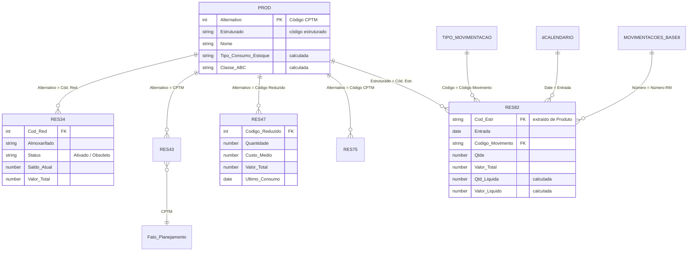

# Modelo de dados

O modelo segue a lógica de **modelagem dimensional** (esquema estrela): a base de materiais **PROD** funciona como dimensão principal e as bases do ERP ALVO funcionam como tabelas de fatos ligadas a ela. O **Código CPTM** (coluna `Alternativo` da PROD) é o identificador principal, conforme confirmado pela CPTM.

## Diagrama

## Relacionamentos

| Base (lado muitos) | Coluna | Liga com (lado um) | Observação |
|---|---|---|---|
| RES34 | Cód. Red. | PROD – Alternativo | Saldo por almoxarifado e obsolescência |
| RES43 | CPTM | PROD – Alternativo | Materiais no ponto de reposição |
| RES47 | Código Reduzido | PROD – Alternativo | Posição do estoque (fotografia de 24/08/2026) |
| RES75 | Código CPTM | PROD – Alternativo | PCAN e movimentação anual |
| RES82 | Cód. Estr. | PROD – Estruturado | A RES82 não tem o Código CPTM |
| RES82 | Código Movimento | Tipo de Movimentação – Código | Classificação entrada/saída/neutro |
| RES82 | Entrada | dCalendario – Date | Filtro por período |
| RES82 | Número RM | Movimentações Materiais (base 8) – Número | Somente Espécie = RM |

Todos os relacionamentos são de **um para muitos**, com filtro em **direção única** (da dimensão para o fato).

## Tratamentos que garantem a chave única

- **PROD:** remoção de 421 linhas de grupo (`Grupo = "Sim"`) e 13 linhas sem código. Essas linhas repetiam o Código CPTM.
- **RES82:** o código estruturado é extraído da coluna `Produto` (texto antes de `" - "`).
- **Base 8:** o número da RM só é ligado aos lançamentos com `Espécie = "RM"`, para não confundir com números de notas fiscais.

## Tabelas criadas no Power BI

| Tabela | Tipo | Uso |
|---|---|---|
| dCalendario | Calculada (DAX) | Datas de 2021 a 2026, ano, mês, mês do ano |
| Tipo de Movimentação | Calculada (DATATABLE) | Classificação dos 98 tipos da RES82 |
| CurvaABC | Calculada (DAX) | Classe A/B/C por valor em estoque |
| Parâmetro Risco / Parâmetro Excesso | Calculada | Limites escolhidos pelo usuário (meses de cobertura) |
| dStatus, dAderencia, dRotatividade, dEtapa, dDestino | Calculada | Categorias usadas nos eixos dos gráficos |
| Dicionário de Indicadores, Mapa de Relacionamentos, Testes de Consistência | Calculada | Documentação exibida na página Metodologia |
| Medidas | Tabela de medidas | Todas as medidas DAX, organizadas em pastas |

## Parâmetro PastaDados

Todas as consultas leem as planilhas a partir do parâmetro **PastaDados**. Para usar o projeto em outro computador, basta mudar esse parâmetro em **Página Inicial → Transformar dados → Editar parâmetros**.
